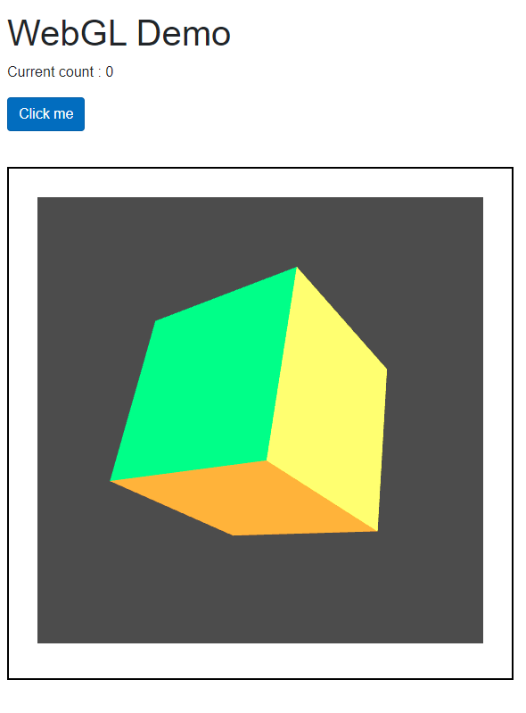
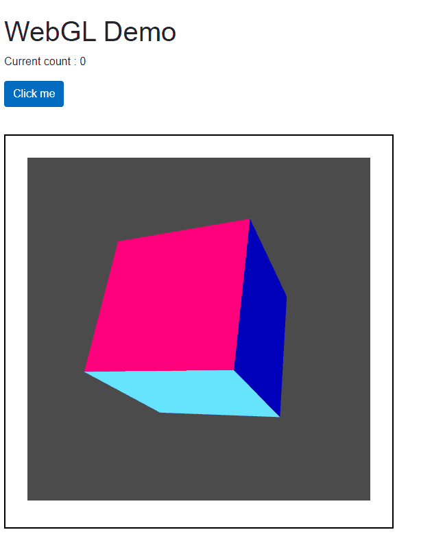

# WebGLCube

The parameters changed in this practice were the data about the cube vertexes, the cube indexes and the colors.

In order to render each side of the cube with a color, I needed to define separately each of the sides of the cube, 6 in total with 4 vertexes each.

The same happens with the indexes that represent the triangulation of each of the sides, 2 triangles per side in a total of 6 faces.

And for the colors I have defined a different color for each of the vertices of the 6 faces. Making sure that on each side of the cube the vertexes have the same color.

Screenshot of the rendered cube:

GIF of the rendered cube:

